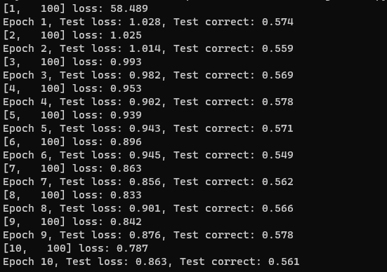

# LFW-CNN-Examples

LFW dataset recognition and matching tasks examples.

山东大学 2020 级软件工程专业《深度学习》课程设计。

## 一、前言

此报告为山东大学 2020 级软件工程专业《深度学习》课程课程设计的报告。

### 1.1 学生个人信息

- 姓名：
- 学号：
- 班级：
- 组队情况：个人组队

### 1.2 实验基本信息

#### 1.2.1 实验选择

根据实验要求，选择“课设 1”完成。

#### 1.2.2 实验要求

实验要求为，使用至少 2 种基于 CNN 的框架结构实现 LFW 数据集的人脸识别任务，例如 ResNet，AlexNet 等。

尝试在课设加入 attention 模块。

### 1.3 实验代码查看

实验代码已开源上传至 GitHub，链接为：https://github.com/cyz020403/LFW-CNN-Examples，可访问在线查看。（实验报告暂未上传）

### 1.4 实验环境

#### 1.4.1 软件环境

- 基于 Anacoda 管理的虚拟环境。
- Python: 3.7
- PyTorch: 1.8.0
- CUDA：11.1

#### 1.4.2 硬件环境

- PC: Dell Precision 3640 Tower
- CPU: lntel(R) Core(TM) i9-10900K CPU @ 3.70 GHz
- 内存: 64 G
- 磁盘: Micron 2300 NVMe 1024 GB（SSD）
- GPU: NVIDIA GeForce RTX 3090

## 二、数据集分析

### 2.1 数据集简介

LFW (Labeled Faces in the Wild) 数据集是一个广泛应用于人脸识别领域的数据集，其中包含来自互联网的 13000 多张人脸图像。在 LFW 上进行人脸识别任务的一般流程包括以下步骤：

1. 数据预处理：从 LFW 数据集中选择要用于训练和测试的图像，并将它们转换成模型所需的格式，例如将图像转换成灰度图像、调整大小等。
2. 特征提取：使用某个深度学习模型（如 VGG、ResNet 等）将图像中的人脸特征提取出来。这可以通过对图像进行前向传递来完成，将其输入到深度神经网络中并提取出网络中间层的特征向量。
3. 特征匹配：对测试图像中的人脸特征向量进行比对，以确定与之最相似的已知人脸特征向量。通常使用的度量包括欧氏距离和余弦相似度等。
4. 结果评估：根据模型的准确性和召回率等指标，评估模型的性能。在 LFW 数据集上，常见的评估方法是使用 ROC 曲线和 AUC (Area Under Curve) 指标。

### 2.2 数据集文件分析

**这部分分析主要参考数据集文件中的”README.md“文件。**

#### 2.2.1 文件组成

分析数据集中的文件，文件组成为：

>- lfw 文件夹
>- pairsDevTest.txt
>- pairsDevTrain.txt
>- peopleDevTest.txt
>- peopleDevTrain.txt
>- README.md

文件概述为：

1. lfw 文件夹：包含所有人脸图像的文件夹。
2. pairs 文件：包含若干对需要进行匹配或者不匹配的人脸图像的路径。
3. people 文件：用于将每个人的名字映射到一组图像文件。该文件包含所有图像的名称、它们所属的人的名称以及其他有关每个人的信息。
4. README.txt：包含LFW数据集的详细信息、许可证和使用说明等。

#### 2.2.2 pairs 文件

在LFW数据集中，"pair"是文件名的前缀，表示一组匹配或不匹配的人脸图像对。这些文件是用于训练和测试的，由两个子集组成：开发子集和测试子集。

在开发子集中，有两个文件：`pairsDevTrain.txt` 和 `pairsDevTest.txt` 。这些文件包含了开发数据集的训练和测试集，以及用于算法开发和实验的匹配和不匹配图像对。

在每个 pair 文件中，文件的第一行是一个整数，表示该文件中匹配或不匹配图像对的数量。随后的行是一对一对的图像名称，分别表示一对匹配或不匹配的人脸图像。文件名的命名规则为：姓名_编号.jpg，其中编号是用于区分不同图像的整数。匹配的图像对具有相同的姓名，而不匹配的图像对具有不同的姓名。

#### 2.2.3 people 文件

`people` 同样是 LFW 数据集中文本文件，它列出了所有人的名称，每个人的名称在一行上。每个名称后面跟着该人出现在数据集中的图像数量。例如：

```
Aaron_Eckhart  7
Aaron_Guiel 5
Aaron_Patterson  5
Aaron_Peirsol 20
Aaron_Pena   2
...
```

`people` 文件在 LFW 数据集的两个“视图”中都有作用，分别用于算法的开发和测试。在开发视图中，它被用作 `peopleDevTraining.txt` 和 `peopleDevTest.txt` ，而在性能测试视图中，它被用作 `people.txt` 文件的基础。

## 三、问题重述

出于本次课设并没有详细的说明，限制问题应该如何设计以及解答，**我主要参考数据集的 “README.md” 文档中的“first formulation”与“second formulation”，自行设计两个题目并分别解答。**

### 3.1 问题 1 - 人脸匹配任务

#### 3.1.1 问题重述

对应 Readme 文档中的“first formulation”：

>In the first formulation, the training information is restricted to the image pairs given in the pairs.txt file. No information about the actual names of the people in the image pairs should be used. This is meant to address the issue of transitivity.
>
> In other words, if one matched pair consists of the 10th and 12th images of George_W_Bush, and another pair consists of the 42nd and 50th images of George_W_Bush, then under this formulation it would not be allowable to use the fact that both pairs consist of images of George_W_Bush in order to form new pairs such as the 10th and 42nd images of George_W_Bush. 
>
>To ensure this holds, one should only use the name information to identify the image, but not provide the name information to the actual algorithm. For this reason, we refer to this formulation as the Image Restricted Configuration. Under this formulation, only the pairs.txt file is needed.

对于这种问题，我们主要根据 pairs 文件完成 “人脸匹配” 的任务，其实现流程大致应为：

1. 数据集获取：下载并准备 LFW 数据集。
2. 读取pairs.txt文件：在 Image Restricted Configuration 下，只需使用 pairs.txt 文件。该文件包含了一系列匹配和非匹配的图像对。
3. 加载图像：根据 pairs.txt 文件中提供的图像路径，从数据集中加载对应的图像。
4. 特征提取：使用人脸识别算法（如 Resnet、Alexnet 等）对图像中的人脸进行特征提取。
5. 计算相似度：通过计算特征向量之间的相似度来确定图像对是否匹配。可以使用余弦相似度或欧氏距离等度量方法。
6. 阈值设定：为了决定两个图像是否匹配，需要设置一个阈值。当相似度高于阈值时，认为两个图像匹配；当相似度低于阈值时，则认为两个图像不匹配。
7. 评估模型性能：使用测试集中的图像对进行人脸匹配，并根据预测结果和真实标签计算模型的准确率、精确率、召回率等指标来评估模型的性能。

**不难发现，问题的重点应该在于“特征提取”，出于训练数据“pairs”文件的特殊性，比较合适的想法是采用对比学习的方式，完成人物数据的 encoder，并在测试集上利用不同人脸 encoder 之间的差异，检测两个人脸是否属于同一人。**

#### 3.1.2 问题完成情况

这种问题在现实中应用广泛，但是在实现过程中，尽管建立了合适的模型，但是最终结果欠佳，我的模型结构大致为（这部分将在下文详细描述）：

- 模型使用 Alexnet，主要优点在于便于实现，适合用于测试。
- **在模型中添加 attention 模块**，提高模型的表现能力。
- loss 函数使用自己定义的 ContrastiveLoss。
- optimizer 使用 Adam。
- 主要思路为 encoder + 相似度比较，来判断两个人脸是否属于同一人。

我分析的难以得到期望准确率的问题在于：

- 数据集太小， 又按照实验要求，没有预训练模型的支持。
- 需要 encoder 到不同 domain 的人太多，每个人的照片太少，很多情况下一个人只有一个照片，使用对比损失进行学习数据量远远不足。
- trainset 与 testset 上没有一致的人脸，对于这种情况，模型难以的得知“testset 上的人应该在什么 domain”，因此也就没办法进行合理的 encoder 以及照片相似度估计。

因为发现了问题所在，所以我没有在使用 Resnet 进行进一步的尝试，Alexnet 训练的结果也不尽人意，最终只能达到 60 % 左右的正确率。

但是，我个人认为模型构建的思路正确，**在理论上对于人数更少、图像更多的任务，是一定可以胜任的，因此我在这篇报告中保留了这部分内容。**

### 3.2 问题 2 - 人脸识别任务

#### 3.2.1 问题重述

对应 Readme 文档中的“second formulation”：

>In the second formulation, the training information is provided as simply the names of the people in each set and the associated images. From this information, one can, for example, formulate as many match and mismatch pairs as one desires, from people within each set. 
>
>For instance, if George_W_Bush and John_Kerry both appear in one set, then any pair of George_W_Bush images can be used as a match pair, and any image of George_W_Bush can be matched with any image of John_Kerry to form a mismatch pair. 
>
>We refer to this formulation as the Unrestricted Configuration, and provide the people.txt that gives the names of people in each set.

对于这种问题，我们主要根据 peoples 文件完成 “人脸识别” 的任务，其实现流程大致应为：

1. 数据集获取：下载并准备LFW数据集。
2. 数据集划分：将数据集划分为训练集和测试集。
3. 读取people.txt文件：在Unrestricted Configuration下，使用people.txt文件。该文件包含了每个集合中人物的姓名信息。
4. 加载图像：根据数据集中的图像路径，加载每个人物的人脸图像。
5. 特征提取：使用人脸识别算法（如 Resnet、Alexnet 等）对图像中的人脸进行特征提取。
6. 构建分类器：使用 softmax 等分类器来对人脸进行分类。每个人物对应一个类别，分类器的目标是将输入的人脸图像正确分类到对应的人物类别。
7. 训练分类器：使用训练集中的人脸图像和对应的标签（人物姓名）来训练softmax分类器。通过反向传播和梯度下降等优化方法，不断调整分类器的权重和偏差，以最小化分类误差。
8. 测试分类器：使用测试集中的人脸图像来评估分类器的性能。将每个测试图像输入到分类器中，得到预测的人物类别，并与真实标签进行比较，计算分类器的准确率、精确率、召回率等评估指标。

**这种问题的重点在于“分类器”的设计，即将每个照片匹配到具体的某一类别上，对于这种任务的设计方式，训练和测试的过程有更强的一致性，在 LFW 这种较小的数据集上更容易收敛。**

#### 3.2.2 问题完成情况

在这种问题的设计上，我选取了 Alexnet 和 Resnet 分别进行测试，准确率为：

- Alexnet：60.42 %
- Resnet：82.92 %

模型的主干描述为：

- 模型分别使用了 Resnet 和 Alexnet，并添加了分类器。
- **在模型中添加 attention 模块**，提高模型的表现能力。
- loss 使用 CrossEntropyLoss。
- optimizer 使用 Adam。
- 为了避免模型过拟合，使用 early stopping 思想。
- 吸取了问题 1 中每个人照片不足问题的经验，只选择照片数量大于一定数量的人进行分类。

## 四、问题 1 - 人脸匹配任务具体实现

### 4.1 pairs、people 文件加载

由于 pairs 文件本身描述复杂，以及与 lfw 照片文件集对应关系复杂，数据处理的过程是一个十分繁琐的过程。

**尽管在问题 1 的后续实验中，我们重点使用了 pairs 数据，但是为了保证数据处理的完整性，这里也给出了 people 文件的加载和处理方式。**

#### 4.1.1 文件路径描述

首先需要定义各个文件的路径：

```python
lfw_dir = './data/lfw'
people_dev_train = './data/peopleDevTrain.txt'
pairs_dev_train = './data/pairsDevTrain.txt'
people_dev_test = './data/peopleDevTest.txt'
pairs_dev_test = './data/pairsDevTest.txt'
```

#### 4.1.2 load_people_file 方法

我们定义“load_people_file”方法完成对 people 文件的加载，其格式分析见上文“2.2 数据集文件分析”，其处理流程具体描述如下：

1. 首先，我们使用`with open(people_file) as f:`语句打开文件并创建一个文件对象`f`，这将确保在处理完文件后正确关闭它。
2. 接下来，我们使用`f.readline().strip()`读取文件的第一行，并使用`strip()`方法去除行末尾的换行符和空格。然后，我们使用`int()`将其转换为一个整数，并将结果赋值给`num_lines`变量。这个整数表示了文件中人员信息的行数。
3. 然后，我们使用列表推导式`[f.readline().strip().split('\t') for i in range(num_lines)]`，在每次循环中读取文件的下一行并进行处理。我们使用`strip()`方法去除行末尾的换行符和空格，然后使用`split('\t')`方法将行按制表符分割成一个列表。整个列表推导式的结果将是一个包含人员信息的列表，每个人员信息都是一个包含多个字段的字符串列表。
4. 最后，我们使用`return`语句返回人员列表`people`和人员信息行数`num_lines`。

代码展示：
```python
def load_people_file(people_file):
    with open(people_file) as f:
        num_lines = int(f.readline().strip())
        people = [f.readline().strip().split('\t') for i in range(num_lines)]
        return people, num_lines
```

#### 4.1.3 load_pairs_file 方法

同样的，我们定义“load_pairs_file”方法完成对 pairs 文件的加载。

1. 首先，我们使用`with open(pairs_file) as f:`语句打开文件并创建一个文件对象`f`，这将确保在处理完文件后正确关闭它。
2. 接下来，我们使用`f.readline().strip()`读取文件的第一行，并使用`strip()`方法去除行末尾的换行符和空格。然后，我们使用`int()`将其转换为一个整数，并将结果赋值给`num_pairs`变量。这个整数表示了文件中配对信息的数量。
3. 然后，我们使用列表推导式`[f.readline().strip().split() for i in range(num_pairs * 2)]`，在每次循环中读取文件的下一行并进行处理。我们使用`strip()`方法去除行末尾的换行符和空格，然后使用`split()`方法默认地将行按空格分割成一个列表。整个列表推导式的结果将是一个包含配对信息的列表，每个配对信息都是一个包含两个元素的字符串列表。
4. 最后，我们使用`return`语句返回配对列表`pairs`和配对信息数量`num_pairs`。

代码展示：

```python
def load_pairs_file(pairs_file):
    with open(pairs_file) as f:
        num_pairs = int(f.readline().strip())
        pairs = [f.readline().strip().split() for i in range(num_pairs * 2)]
        return pairs, num_pairs
```

**正负样例构建**

使用上述定义的方法，构建 match 和 mismatch 的数据集。

```python
peopel_train, num_peopel_train = load_people_file(people_dev_train)
pairs_train, num_pairs_train = load_pairs_file(pairs_dev_train)
pairs_train_match = pairs_train[:num_pairs_train]
pairs_train_mismatch = pairs_train[num_pairs_train : 2 * num_pairs_train]

people_test, num_people_test = load_people_file(people_dev_test)
pairs_test, num_pairs_test = load_pairs_file(pairs_dev_test)
pairs_test_match = pairs_test[:num_pairs_test]
pairs_test_mismatch = pairs_test[num_pairs_test : 2 * num_pairs_test]
```

### 4.2 LFWDataset 构建

LFWDataset 构建过程，主要是**根据已经导入的 pairs 文件，完成 `torch.utils.data` 的 `Dataset` 中的 `__init__`、`__len__`、`__getitem__` 方法，使得其可以组织成为 `torch.utils.data` 中的 `DataLoader` ，供模型训练过程使用。**

#### 4.2.1 `__init__()` 方法

对 LFWDataset 类，传入 match 与mismatch 的数据集。

代码展示：

```python
class LFWDataset(Dataset):
    def __init__(self, dataset, pairs_match, pairs_mismatch):
        self.dataset = dataset
        self.pairs_match = pairs_match
        self.pairs_mismatch = pairs_mismatch
```

#### 4.2.2 `__len__()` 方法

出于训练的需要，需要完成 `__len__()` 方法，描述数据集的长度。

代码展示：

```python
class LFWDataset(Dataset):
    def __len__(self):
        return len(self.pairs_match) + len(self.pairs_mismatch)
```

#### 4.2.3 `__getitem__()` 方法

LFWDataset  类的重点在于定义`__getitem__`方法，该方法负责根据索引从数据集中获取一个项目。

`__getitem__`方法开始使用一个if-else语句来处理基于`index`参数的两种不同情况。其主要思想为：

1. 在第一种情况下（`index < len(self.pairs_match)`）
   - 从类的`pairs_match`属性中检索第`index`个pair。
   - 通过在`lfw_dataset.class_to_idx`中访问相应的索引，提取`pair`的标签。
   - 使用筛选`lfw_dataset.samples`以获取属于相同标签的所有样本。
   - 通过使用`pair`中的值索引`person_samples`，确定要进行比较的两个图像的路径（`img1_path`和`img2_path`）。
   - 将标签设置为1（表示匹配）。

2. 在第二种情况下（当`index >= len(self.pairs_match)`）
   - 从类的`pairs_mismatch`属性中检索第`(index - len(self.pairs_match))`个pair。
   - 通过在`lfw_dataset.class_to_idx`中访问相应的索引，提取pair中的标签。
   - 使用筛选`lfw_dataset.samples`以获取属于第一个和第二个标签的所有样本。
   - 通过使用pair中的值索引`person1_samples`和`person2_samples`，确定要进行比较的两个图像的路径（`img1_path`和`img2_path`）。
   - 将标签设置为0（表示不匹配）。

在确定图像路径和标签之后，代码继续执行以下步骤：
- 使用`Image.open()`函数打开图像（`img1`和`img2`），并使用`convert('RGB')`将其转换为RGB格式。
- 对两个图像应用转换（`self.dataset.transform`）。
- 最后，它返回经过转换的图像（`img1`和`img2`）以及相应的标签。

代码展示：

```python
class LFWDataset(Dataset):
    def __getitem__(self, index):
        if index < len(self.pairs_match):
            pair = self.pairs_match[index]

            # test +++++++++++++++++++++++++++++++++++++++++++++++++++++++++++++++
            # print(pair) # ['Aaron_Peirsol', '1', '2']
            # test +++++++++++++++++++++++++++++++++++++++++++++++++++++++++++++++

            label = lfw_dataset.class_to_idx[pair[0]]
            person_samples = [s for s in lfw_dataset.samples if s[1] == label]
            img1_path = person_samples[int(pair[1]) - 1][0]
            img2_path = person_samples[int(pair[2]) - 1][0]
            label = 1

            # test +++++++++++++++++++++++++++++++++++++++++++++++++++++++++++++++
            # print(img1_path) # ./data/lfw\Aaron_Peirsol\Aaron_Peirsol_0001.jpg
            # print(img2_path) # ./data/lfw\Aaron_Peirsol\Aaron_Peirsol_0002.jpg
            # test +++++++++++++++++++++++++++++++++++++++++++++++++++++++++++++++

        else:
            pair = self.pairs_mismatch[index - len(self.pairs_match)]

            # test +++++++++++++++++++++++++++++++++++++++++++++++++++++++++++++++
            # print (pair) # ['AJ_Cook', '1', 'Marsha_Thomason', '1']
            # test +++++++++++++++++++++++++++++++++++++++++++++++++++++++++++++++
            
            label1 = lfw_dataset.class_to_idx[pair[0]]
            label2 = lfw_dataset.class_to_idx[pair[2]]
            person1_samples = [s for s in lfw_dataset.samples if s[1] == label1]
            person2_samples = [s for s in lfw_dataset.samples if s[1] == label2]
            img1_path = person1_samples[int(pair[1]) - 1][0]
            img2_path = person2_samples[int(pair[3]) - 1][0]

            label = 0

            # test +++++++++++++++++++++++++++++++++++++++++++++++++++++++++++++++
            # print(img1_path) # ./data/lfw\AJ_Cook\AJ_Cook_0001.jpg
            # print(img2_path) # ./data/lfw\Marsha_Thomason\Marsha_Thomason_0001.jpg
            # test +++++++++++++++++++++++++++++++++++++++++++++++++++++++++++++++
        
        img1 = Image.open(img1_path).convert('RGB')
        img2 = Image.open(img2_path).convert('RGB')
        img1 = self.dataset.transform(img1)
        img2 = self.dataset.transform(img2)
        
        return img1, img2, label
```

### 4.3 `AlexNetWithAttention` 模型定义

在我对 Alexnet 模型的实现中，添加了 Attention 机制，我们将分块阐述模型的结构。

#### 4.3.1 模型 `init ` 方法

init 方法用于初始化神经网络模型的层和模块，由其定义的模型由几个组件组成：

1. `self.features`：
   - 表示模型的特征提取部分，包括一系列的卷积和池化层。
   - 卷积层具有不同的内核大小和通道维度，逐步从输入图像中提取特征。
   - 每个卷积层后面都应用了 ReLU 激活函数。
2. `self.attention`：
   - 表示模型的注意力机制，由两个卷积层组成。
   - 第一个卷积层将通道数从256降到64。
   - 第一个卷积层后面应用了ReLU激活函数。
   - 第二个卷积层将通道数从64降到1。
   - 第二个卷积层后面应用了Sigmoid激活函数（`nn.Sigmoid()`），产生一个注意力图。
3. `self.fc1`、`self.fc2`和`self.fc3`：
   - 这些都是`nn.Linear`的实例，表示模型的全连接层。
   - `self.fc1`接收来自前面层的展平输出，并将其映射到一个4096维的特征空间。
   - `self.fc2`进一步将4096维的特征映射到另一个4096维的特征空间。
   - `self.fc3`将4096维的特征映射到一个1024维的特征空间。

总体而言，init 方法定义了`AlexNetWithAttention`模型的架构，将 AlexNet 架构与注意力机制结合起来。

该模型接收输入图像并应用一系列的卷积和池化操作来提取特征，然后，对提取的特征应用注意力机制，产生一个注意力图，最后，将这些特征通过全连接层以获取最终输出。

代码展示：

```python
class AlexNetWithAttention(nn.Module):
    def __init__(self):
        super(AlexNetWithAttention, self).__init__()
        
        self.features = nn.Sequential(
            nn.Conv2d(3, 96, kernel_size=11, stride=4),
            nn.ReLU(inplace=True),
            nn.MaxPool2d(kernel_size=3, stride=2),
            nn.Conv2d(96, 256, kernel_size=5, padding=2),
            nn.ReLU(inplace=True),
            nn.MaxPool2d(kernel_size=3, stride=2),
            nn.Conv2d(256, 384, kernel_size=3, padding=1),
            nn.ReLU(inplace=True),
            nn.Conv2d(384, 384, kernel_size=3, padding=1),
            nn.ReLU(inplace=True),
            nn.Conv2d(384, 256, kernel_size=3, padding=1),
            nn.ReLU(inplace=True),
            nn.MaxPool2d(kernel_size=3, stride=2),
        )

        self.attention = nn.Sequential(
            nn.Conv2d(256, 64, kernel_size=3, padding=1),
            nn.ReLU(inplace=True),
            nn.Conv2d(64, 1, kernel_size=1),
            nn.Sigmoid()
        )
        
        self.fc1 = nn.Linear(6 * 6 * 256, 4096)
        self.fc2 = nn.Linear(4096, 4096)
        # self.fc3 = nn.Linear(4096, 1)
        self.fc3 = nn.Linear(4096, 1024)
    
```

#### 4.3.2 模型 `forword` 方法

`forword` 方法简单地将输入的两个图像放入模型进行编码，最终返回编码结果。

需要注意的是，这这两个图像将在后续工作中作作为对比使用。

代码展示：

```python
class AlexNetWithAttention(nn.Module):
	def forward(self, x1, x2):

        # test +++++++++++++++++++++++++++++++++++++++++++++++++++++++++++++++
        # print(x1.shape) # torch.Size([16, 3, 256, 256])
        # test +++++++++++++++++++++++++++++++++++++++++++++++++++++++++++++++

        x1 = self.features(x1)
        x2 = self.features(x2)

        # test +++++++++++++++++++++++++++++++++++++++++++++++++++++++++++++++
        # print(x1.shape) # torch.Size([16, 256, 6, 6])
        # test +++++++++++++++++++++++++++++++++++++++++++++++++++++++++++++++
        
        # Attention mechanism
        a1 = self.attention(x1)
        a2 = self.attention(x2)
        x1 = x1 * a1
        x2 = x2 * a2

        # test +++++++++++++++++++++++++++++++++++++++++++++++++++++++++++++++
        # print(x1.shape) # torch.Size([16, 256, 6, 6])
        # test +++++++++++++++++++++++++++++++++++++++++++++++++++++++++++++++
        
        x1 = x1.view(x1.size(0), -1)
        x2 = x2.view(x2.size(0), -1)
        x1 = self.fc1(x1)
        x2 = self.fc1(x2)
        x1 = self.fc2(x1)
        x2 = self.fc2(x2)
        x1 = self.fc3(x1)
        x2 = self.fc3(x2)

        # test +++++++++++++++++++++++++++++++++++++++++++++++++++++++++++++++
        # print(x1.shape) # torch.Size([16, 2])
        # test +++++++++++++++++++++++++++++++++++++++++++++++++++++++++++++++
        
        return x1, x2
```

### 4.4 对比损失的定义

**出于 pair 文件的特殊性，数据的结构极其适合使用对比损失训练，以拉近相同样本之间距离，推远不同样本之间的距离**。

我们定义 `ContrastiveLoss` 类完成对比损失的定义，其实现思想为：

`ContrastiveLoss`类有一个`__init__`方法，用于初始化类的实例。它接受一个名为`margin`的可选参数，默认值为2.0。`margin`被存储为类实例的属性。

在`forward`方法中，执行以下步骤：

1. 使用`F.pairwise_distance`函数计算`output1`和`output2`之间的欧氏距离。该函数计算两个输入张量对应元素之间的欧氏距离。计算得到的张量被赋值给变量`euclidean_distance`。
2. 使用计算得到的欧氏距离和提供的标签(`label`)计算对比损失。
   - `torch.pow(euclidean_distance, 2)` 对欧氏距离进行逐元素平方。
   - `(label) * torch.pow(euclidean_distance, 2)` 计算标签张量和平方的欧氏距离张量的逐元素乘积。
   - `torch.clamp(self.margin - euclidean_distance, min=0.0)` 计算`self.margin`与欧氏距离之间的逐元素差异，将差异值夹紧到最小值为0.0。这确保了差异为非负值。
   - `(1 - label) * torch.pow(torch.clamp(self.margin - euclidean_distance, min=0.0), 2)` 计算补集标签张量和平方的夹紧差异张量的逐元素乘积。
   - `(label) * torch.pow(euclidean_distance, 2) + (1 - label) * torch.pow(torch.clamp(self.margin - euclidean_distance, min=0.0), 2)` 通过逐元素相加组合了前面的两个项。
   - `torch.mean(...)` 计算结果张量的平均值，表示批次中的平均对比损失。
3. 计算得到的对比损失作为`forward`方法的输出返回。

代码展示：

```python
class ContrastiveLoss(nn.Module):
    def __init__(self, margin=2.0):
        super(ContrastiveLoss, self).__init__()
        self.margin = margin

    def forward(self, output1, output2, label):
        euclidean_distance = F.pairwise_distance(output1, output2, keepdim=True)
        # print(euclidean_distance.shape)
        # print(euclidean_distance)
        # exit()
        loss_contrastive = torch.mean((label) * torch.pow(euclidean_distance, 2) +
                                      (1 - label) * torch.pow(torch.clamp(self.margin - euclidean_distance, min=0.0), 2))

        return loss_contrastive
```

### 4.5 定义 train 过程

完成数据、模型、损失函数的定义之后，我们需要组织数据和模型进行训练。

整个训练过程需要处理很多事务，但都是深度学习中常用的方法，其思路如下：

1. `train`函数接受多个参数：`model`（要训练的模型），`criterion`（损失函数），`optimizer`（用于更新模型参数的优化器），`train_loader`（包含训练数据的数据加载器），以及 `device`（计算设备）。
2. 函数开始通过 `model.train()` 将模型设置为训练模式。这将允许模型在训练过程中更新其参数。
3. 初始化变量 `running_loss` 为 0.0。该变量将累计训练过程中的损失值。
4. 函数进入一个循环，遍历 `train_loader` 中的数据。循环变量 `i` 跟踪当前迭代的次数。在循环内部，代码从 `train_loader` 中获取一个数据批次（`img1`、`img2` 和 `label`）。
5. 将获取的数据移动到 `device` 上。
6. 使用 `optimizer.zero_grad()` 将优化器的梯度置零。
7. 调用模型，使用 `img1` 和 `img2` 作为输入，生成给定输入的模型输出。将输出重新赋值给 `img1` 和 `img2`。
8. 通过将 `criterion`（损失函数）应用于 `img1`、`img2` 和 `label` 来计算损失。使用 `.float().view(-1, 1)` 将 `label` 转换为浮点数并重新调整形状，以匹配标签的预期形状。
9. 调用 `loss.backward()` 执行反向传播，计算损失相对于模型参数的梯度。
10. 优化器通过 `optimizer.step()` 沿着梯度的方向迈出一步，根据计算得到的梯度更新模型参数。
11. 使用 `running_loss += loss.item()` 将当前损失值累加到 `running_loss` 中。
12. 每100次迭代（当 `i` 可以被100整除时），使用 `print` 语句打印前100次迭代的平均损失。

代码展示：

```python
def train(model, criterion, optimizer, train_loader, device):
    model.train()
    running_loss = 0.0
    
    for i, data in enumerate(train_loader, 0):
        img1, img2, label = data
        img1, img2, label = img1.to(device), img2.to(device), label.to(device)
        
        optimizer.zero_grad()

        img1, img2 = model(img1, img2)

        # test +++++++++++++++++++++++++++++++++++++++++++++++++++++++++++++++
        # print(img1.shape)  # torch.Size([16, 2])
        # print(img2.shape)  # torch.Size([16, 2])
        # print(label.shape) # torch.Size([16])
        # test +++++++++++++++++++++++++++++++++++++++++++++++++++++++++++++++

        # euclidean_distance = F.pairwise_distance(img1, img2, keepdim=True)
        # loss = criterion(euclidean_distance, label.float().view(-1, 1))

        # test +++++++++++++++++++++++++++++++++++++++++++++++++++++++++++++++
        # print(euclidean_distance.shape) # torch.Size([16, 1])
        # test +++++++++++++++++++++++++++++++++++++++++++++++++++++++++++++++

        loss = criterion(img1, img2, label.float().view(-1, 1))
        loss.backward()
        
        optimizer.step()
        
        running_loss += loss.item()
        if i % 100 == 99:
            print('[%d, %5d] loss: %.3f' % (epoch + 1, i + 1, running_loss / 100))
            running_loss = 0.0
```

### 4.6 定义 test 过程

最终，我们定义 test 过程，调用已经组织的训练集数据，测试模型是否可以对于给定的图片样本对，正确地判断其是否来自于同一个人。

其实现过程为：

1. test 方法接受四个参数：`model`、`criterion`、`test_loader`和`device`。
2. 函数开始使用`model.eval()`将模型设置为评估模式，确保在评估过程中不进行梯度计算。
3. 然后，它初始化变量`running_loss`来跟踪评估过程中的总损失，并初始化`test_correct`来计算正确预测的数量。
4. 评估过程在`with torch.no_grad()`上下文中进行，该上下文禁用梯度计算，在评估过程中不需要进行反向传播。
5. 在循环内部，函数遍历`test_loader`，它提供用于评估的数据批次。
6. 数据批次包含`img1`、`img2`和`label`数据。这些变量通过`to(device)`移动到 GPU，以确保计算在指定设备上执行。然后，调用模型并使用`img1`和`img2`作为输入，生成表示模型预测的输出张量`img1`和`img2`。
7. 将损失函数应用于`img1`、`img2`和`label`，计算损失。使用`loss.item()`将损失值添加到`running_loss`中。
8. 接下来，使用`F.pairwise_distance`计算`img1`和`img2`之间的欧几里德距离，该距离用于确定图像是否匹配。
9. 将欧几里德距离与阈值进行比较，以将图像对分类为匹配或不匹配，通过计算匹配项的数量来更新正确预测的数量。
10. 随后打印欧几里德距离、比较结果（如果距离小于0.8则为`True`，否则为`False`）。
11. 在遍历`test_loader`中的所有批次之后，函数通过将`running_loss`除以`test_loader`的长度来计算每个批次的平均损失。类似地，它通过将`test_correct`除以数据集中的样本总数来计算准确率。
12. 最后，函数返回平均损失和准确率。

代码展示：

```python
def test(model, criterion, test_loader, device):
    model.eval()
    running_loss = 0.0
    test_correct = 0

    with torch.no_grad():
        for i, data in enumerate(test_loader, 0):
            img1, img2, label = data
            img1, img2, label = img1.to(device), img2.to(device), label.to(device)
            
            img1, img2 = model(img1, img2)
            loss = criterion(img1, img2, label.float().view(-1, 1))
            running_loss += loss.item()

            euclidean_distance = F.pairwise_distance(img1, img2, keepdim=True)
            test_correct += (label.view(-1, 1) == (euclidean_distance < 0.5)).sum().item()

            print(euclidean_distance)
            print(label.view(-1, 1) == (euclidean_distance < 0.8))
            print(i)

    return running_loss / len(test_loader), test_correct / len(test_loader.dataset)
```

### 4.7 main 方法

在 main 方法中，我们定义超参数，并循环多个 epoch 完成模型的训练任务。

```python
# hyperparameters
lr = 0.001
batch_size = 16
num_epochs = 10
device = torch.device("cuda" if torch.cuda.is_available() else "cpu")

for epoch in range(num_epochs):
    train(model, criterion, optimizer, train_loader, device)
    test_loss, test_correct = test(model, criterion, test_loader, device)
    print('Epoch %d, Test loss: %.3f, Test correct: %.3f' % (epoch + 1, test_loss, test_correct))
```

### 4.8 结果展示



## 五、问题 2 - 人脸识别任务具体实现

### 5.1 进一步描述设计的问题

在开始描述这部分实现过程之前，描述这部分与之前的一些不同点：

1. “3.2.2”中已经提及，这部分实现中，我吸取了问题 1 中每个人照片不足问题的经验，**只选择照片数量大于一定数量的人进行分类。因此，尽管数据集中有超过五千个人，最终进行分类任务的人只有达到要求的几十个。**
2. “2.2.3 people 文件” 中已经提及 people 文件的结构，其与 lfw 图片文件夹一一对应，描述了其中每个人有多少张照片，因此，实际上在数据处理的过程中并没有用到 people 文件，而是直接根据 lfw 图片文件夹的结构，直接确定了数据集。**但是，这种做法并非混淆训练集与测试集（即 people 文件对应的 train 和 test 两个文件），而是相当于将 train 和 test 文件合并，在实际处理中，找到 train 和 test 文件中所有照片数量大于要求数值的人，去除他们的照片放到同一个集合中，再经过打乱后重新划分训练集和测试集。**这种数据集的设置更符合一般深度学习任务的结构。

### 5.2 LFW 数据筛选

我设定了照片数量大于 30 的人进行训练和测试。

其实现思路为：

1. 定义变量`lfw_path`，它存储了LFW数据集目录的路径。

2. 初始化一个空列表`selected_people`，用于存储在数据集中拥有超过30张照片的人物的名称。

3. 循环遍历LFW数据集中的文件夹，在循环内部：

   - 使用`lfw_path`和当前文件夹名(`person_dir`)构建`person_path`。
   - 代码检查`person_path`是否不是一个文件夹，如果是，则继续下一次迭代。
   - 通过获取`person_path`中文件列表的长度来计算当前人物文件夹中的照片数量。
   - 如果照片数量(`image_count`)大于30，则将当前人物的文件夹名(`person_dir`)添加到`selected_people`列表中。
4. 将变量`total_person`赋值为`selected_people`列表的长度，表示拥有超过30张照片的人物的总数。
5. 另一个变量`total_photo`初始化为0，将用于跟踪照片的总数。
6. 新的循环遍历`selected_people`列表中的每个人物。
   - 在循环内部，使用`lfw_path`和当前人物的文件夹名(`person`)构建`person_path`。
   - 通过获取`person_path`中文件列表的长度来计算当前人物文件夹中的照片数量。
   - 将`image_count`添加到`total_photo`计数中。
   - 打印人物的名称和他们拥有的照片数量。
7. 最后，打印总人数和总照片数。

代码展示：

```python
# LFW数据集路径
lfw_path = "./data/lfw"

# 用于存储照片数量大于20的人物
selected_people = []

# 遍历LFW数据集中的文件夹
for person_dir in os.listdir(lfw_path):
    person_path = os.path.join(lfw_path, person_dir)
    if not os.path.isdir(person_path):
        continue
    
    # 统计当前人物文件夹中的照片数量
    image_count = len(os.listdir(person_path))
    
    # 如果照片数量大于20，则保留该人物
    if image_count > 30:
        selected_people.append(person_dir)

total_person = len(selected_people)
total_photo = 0
for person in selected_people:
    person_path = os.path.join(lfw_path, person)
    image_count = len(os.listdir(person_path))
    total_photo += image_count
    print(f"{person}: {image_count} images")

print(f"Total: {total_person} people")
print(f"Total: {total_photo} images")
```

### 5.3 图像 transform

使用 torchvision.transforms 中的 transforms 对图片进行预处理，包含了居中处理、正则化等操作。

这里只进行定义，将在下面的代码中进行调用。

```python
transform = transforms.Compose([
    transforms.Resize(256), 
    transforms.CenterCrop(256),
    transforms.ToTensor(),
    transforms.Normalize(mean=[0.5, 0.5, 0.5], std=[0.5, 0.5, 0.5])
])
```

### 5.4 LFW 图像数据加载

这部分，我们根据以上选取的人物以及 transform，加载数据集中的图像，组织成同一个集合并划分为训练集和测试集。其主要思路为：

1. 通过使用`enumerate`函数迭代选中的人物。在循环内部，通过将`lfw_path`（可能是根目录）与当前人物的名称进行连接来构建人物目录的路径。
2. 
   使用`os.listdir(person_path)`从人物目录中获取存在的图像文件列表。
3. 
   在嵌套循环中，遍历图像文件列表中的每个图像文件。
4. 
   在嵌套循环内部，通过将当前人物目录路径与当前图像文件进行连接来构建当前图像的完整路径。
5. 
   使用PIL库的`Image.open`函数打开图像，提供图像路径`image_path`。
6. 打开图像后，使用名为`transform`的函数对图像进行转换。转换后的图像存储在变量`transformed_image`中。

7. 将转换后的图像附加到名为`photo_list`的列表中，该列表收集所有转换后的图像。

8. 将表示人物标签的索引`i`附加到名为`label_list`的另一个列表中。该列表跟踪每个图像对应的标签。

9. 一旦完成对所有图像和人物的迭代，代码使用`torch.stack`和`torch.tensor`函数将`photo_list`和`label_list`转换为`torch.Tensor`类型的张量。

10. 检查是否存在支持CUDA的GPU，并相应地分配设备。如果存在GPU，则使用`to`方法将张量`photo_list`和`label_list`移动到GPU上。

11. 使用`np.random.permutation`基于`photo_list`的长度生成随机排列的索引。

12. 使用随机排列的索引，代码相应地对`photo_list`和`label_list`张量进行洗牌。

13. 代码使用未指定库中的`train_test_split`函数将洗牌后的张量`photo_list`和`label_list`分割为训练集和测试集。训练集分配给`train_X`和`train_Y`，而测试集分配给`test_X`和`test_Y`。测试集大小设置为0.2（数据的20%），随机状态固定为42以确保可重现性。


代码展示：

```python
# 遍历选中的人物
for i, person in enumerate(selected_people):
    person_path = os.path.join(lfw_path, person)
    image_files = os.listdir(person_path)

    # 遍历每个人物的照片
    for image_file in image_files:
        image_path = os.path.join(person_path, image_file)
        image = Image.open(image_path)
        transformed_image = transform(image)  # 应用图像转换

        photo_list.append(transformed_image)
        label_list.append(i)

# 转换为 torch
photo_list, label_list = torch.stack(photo_list), torch.tensor(label_list)
device = torch.device("cuda:0" if torch.cuda.is_available() else "cpu")
photo_list, label_list = photo_list.to(device), label_list.to(device)
print(photo_list.shape)
print(label_list.shape)
idx = np.random.permutation(photo_list.shape[0])
photo_list, label_list = photo_list[idx], label_list[idx]

train_X, test_X, train_Y, test_Y = train_test_split(photo_list, label_list, test_size=0.2, random_state=42)
```

### 5.5 定义 LFW Dataset 类

与问题 1 中的一致，为了能使得数据便于在训练和测试过程中加载，我们完成 `torch.utils.data` 的 `Dataset` 中的 `__init__`、`__len__`、`__getitem__` 方法，使得其可以组织成为 `torch.utils.data` 中的 `DataLoader` ，供模型训练过程使用。

与问题一中的不同，由于上文已经对数据进行了充分的处理，这里只需要最基本的实现即可。

其中 X 表示了训练图像，Y 表示了当前图像数据哪一个人物。

代码展示：
```python
class my_LFW_Dataset:
    def __init__(self, X, Y):
        self.X = X
        self.Y = Y

    def __getitem__(self, index):
        return self.X[index], self.Y[index]

    def __len__(self):
        return len(self.X)

train_dataset = my_LFW_Dataset(train_X, train_Y)
test_dataset = my_LFW_Dataset(test_X, test_Y)
train_loader = DataLoader(train_dataset, batch_size=32, shuffle=True)
test_loader = DataLoader(test_dataset, batch_size=32, shuffle=True)
```

### 5.6 `AlexNetWithAttention` 模型定义

AlexNet With Attention 模型与 “4.3” 部分的模型一致，不再重复描述。

### 5.7 `ResNetWithAttention` 模型定义

在这部分，介绍搭建的 Resnet 模型。

#### 5.7.1 定义基本的ResNet模块

首先我们定义基本的残差块，以简化 ResNet 模型的实现。接下来对实现过程进行描述：

1. `__init__`方法为`BasicBlock`类的构造函数。它接受三个参数：`in_channels`、`out_channels`和`stride`（默认值为1）。
2. 在构造函数内部：
   - 使用`nn.Conv2d`定义了第一个卷积层（`self.conv1`）。它的输入通道数为`in_channels`，输出通道数为`out_channels`，使用3x3的卷积核大小，步长为`stride`，填充为1，且没有偏置项。该卷积层对输入进行空间卷积操作。
   - 使用`nn.BatchNorm2d`定义了第一个批归一化层（`self.bn1`），用于对第一个卷积层的输出在批次维度上进行归一化。
   - 类似地，定义了第二个卷积层（`self.conv2`），输入通道数为`out_channels`，其余参数与`self.conv1`相同。该卷积层对第一个卷积层的输出进行操作。
   - 使用`nn.BatchNorm2d`定义了第二个批归一化层（`self.bn2`），其输入为第二个卷积层的输出。
3. 接下来，基于条件`stride != 1`或`in_channels != self.expansion * out_channels`定义了一个快捷连接。如果任一条件成立，则创建一个由多个操作组成的序列，构成快捷连接：
   - 添加一个1x1卷积层（`nn.Conv2d`），调整输入通道数（`in_channels`）以匹配`self.expansion * out_channels`。它使用步长`stride`，且没有偏置项。
   - 添加一个批归一化层（`nn.BatchNorm2d`），对卷积层的输出进行归一化。
4. `forward`方法定义了`BasicBlock`类的前向传播。它以输入张量`x`作为参数。

5. 在`forward`方法内部：
   - 将输入张量`x`通过第一个卷积层，并依次经过批归一化和ReLU激活函数。
   - 将得到的张量通过第二个卷积层，并依次经过批归一化。
   - 将快捷连接存储在`self.shortcut`中的内容应用于输入张量`x`。
   - 将快捷连接的输出和第二个卷积层的输出进行逐元素相加。
   - 将得到的张量通过ReLU激活函数。
   - 最后，将修改后的张量作为前向传播的输出返回。

代码展示：

```python
class BasicBlock(nn.Module):
    expansion = 1

    def __init__(self, in_channels, out_channels, stride=1):
        super(BasicBlock, self).__init__()
        self.conv1 = nn.Conv2d(
            in_channels, out_channels, kernel_size=3, stride=stride, padding=1, bias=False
        )
        self.bn1 = nn.BatchNorm2d(out_channels)
        self.conv2 = nn.Conv2d(out_channels, out_channels, kernel_size=3, stride=1, padding=1, bias=False)
        self.bn2 = nn.BatchNorm2d(out_channels)

        self.shortcut = nn.Sequential()
        if stride != 1 or in_channels != self.expansion * out_channels:
            self.shortcut = nn.Sequential(
                nn.Conv2d(
                    in_channels,
                    self.expansion * out_channels,
                    kernel_size=1,
                    stride=stride,
                    bias=False,
                ),
                nn.BatchNorm2d(self.expansion * out_channels),
            )

    def forward(self, x):
        out = F.relu(self.bn1(self.conv1(x)))
        out = self.bn2(self.conv2(out))
        out += self.shortcut(x)
        out = F.relu(out)
        return out
```

#### 5.7.2 定义ResNet-18模型

根据上述定义的残差块，搭建 ResNet 模型。其详细描述如下：

1. `__init__`方法，用于初始化ResNet模型。它接受以下参数：`block`、`num_blocks`和`num_classes`（默认为1000）。初始化过程首先将初始通道数（`self.in_channels`）设置为64。
2. 接下来，定义以下层：
   - `self.conv1`：一个卷积层，具有3个输入通道、64个输出通道、7x7的卷积核尺寸、步长为2、填充为3，且没有偏置。
   - `self.bn1`：一个具有64个输入通道的批归一化层。
   - `self.maxpool`：一个最大池化层，具有3x3的池化核尺寸、步长为2、填充为1。
3. 然后，使用`_make_layer`方法创建了四个层（`self.layer1`到`self.layer4`）。这些层是通过使用不同的参数调用`_make_layer`方法创建的。

4. `_make_layer`方法接受上述参数以及当前的`in_channels`值。它根据指定的块数创建一个层的列表。每个块都是通过使用适当的参数调用`block`函数创建的。`in_channels`值更新为块的输出通道乘以块的扩展因子。最后，该方法返回包含所有创建的层的`nn.Sequential`容器。

5. `forward`方法定义了ResNet模型的前向传播过程。它接受一个输入张量`x`。前向传播过程如下：
   - 输入张量`x`通过初始的卷积层（`self.conv1`）、批归一化层（`self.bn1`）和ReLU激活函数（`F.relu`）。
   - 然后将结果通过最大池化层（`self.maxpool`）。
   - 上一步的输出通过每个层（`self.layer1`到`self.layer4`）依次传递。
   - 结果输出通过自适应平均池化层（`self.avgpool`），将空间维度转换为1x1。
   - 输出通过`torch.flatten`将其展平为1维张量。
   - 展平的张量通过全连接层（`self.fc`）。
   - 返回最终的输出。

代码展示：

```python
class ResNet(nn.Module):
    def __init__(self, block, num_blocks, num_classes=1000):
        super(ResNet, self).__init__()
        self.in_channels = 64

        self.conv1 = nn.Conv2d(3, 64, kernel_size=7, stride=2, padding=3, bias=False)
        self.bn1 = nn.BatchNorm2d(64)
        self.maxpool = nn.MaxPool2d(kernel_size=3, stride=2, padding=1)
        
        self.layer1 = self._make_layer(block, 64, num_blocks[0], stride=1)
        self.layer2 = self._make_layer(block, 128, num_blocks[1], stride=2)
        self.layer3 = self._make_layer(block, 256, num_blocks[2], stride=2)
        self.layer4 = self._make_layer(block, 512, num_blocks[3], stride=2)
        
        self.avgpool = nn.AdaptiveAvgPool2d((1, 1))
        self.fc = nn.Linear(512 * block.expansion, num_classes)

    def _make_layer(self, block, out_channels, num_blocks, stride):
        strides = [stride] + [1] * (num_blocks - 1)
        layers = []
        for stride in strides:
            layers.append(block(self.in_channels, out_channels, stride))
            self.in_channels = out_channels * block.expansion
        return nn.Sequential(*layers)

    def forward(self, x):
        out = F.relu(self.bn1(self.conv1(x)))
        out = self.maxpool(out)

        out = self.layer1(out)
        out = self.layer2(out)
        out = self.layer3(out)
        out = self.layer4(out)

        out = self.avgpool(out)
        out = torch.flatten(out, 1)
        out = self.fc(out)
        return out
```

### 5.8 定义 train 过程

完成数据、模型、损失函数的定义之后，我们需要组织数据和模型进行训练。

整个训练过程需要处理很多事务，但都是深度学习中常用的方法，其思路如下：

1. 初始化变量 `best_acc` 和 `best_num_epochs`，用于跟踪最佳准确率和相应的轮次。
2. 开始循环迭代指定的轮次数。
3. 对于每个轮次，将模型设置为训练模式（`model.train()`）。
4. 初始化 `train_loss` 和 `train_acc`，用于跟踪当前轮次的训练损失和准确率。
5. 使用 `enumerate(train_loader)` 迭代训练数据加载器中的数据批次。
6. 对于每个批次，执行以下步骤：
   - 重置优化器的梯度（`optimizer.zero_grad()`）。
   - 将输入数据通过模型获得输出（`outputs = model(inputs)`）。
   - 使用给定的损失函数计算输出与标签之间的损失（`loss = criterion(outputs.squeeze(), labels)`）。
   - 反向传播损失以更新模型的参数（`loss.backward()` 和 `optimizer.step()`）。
   - 通过将预测的标签与真实标签进行比较，计算训练准确率（`torch.max(outputs.data, 1)` 和 `torch.mean(pred.eq(labels.data.view_as(pred)).type(torch.FloatTensor)).item() * len(inputs)`）。
   - 每处理完 10 个批次并且批次数大于 0 时，打印训练批次的信息。
7. 完成该轮次的训练迭代后，进入无梯度计算的代码块（`with torch.no_grad()`）。
8. 在该代码块内，调用 `test` 函数评估模型在 `test_loader` 上的性能，获取测试损失和准确率。
9. 打印测试损失和准确率。
10. 如果测试准确率优于之前的最佳准确率，则更新 `best_acc` 和 `best_num_epochs` 变量，并将模型的状态保存到文件（`'./best_model.pth'`）。并打印当前最佳准确率和相应的轮次。
11. 最后，返回达到的最佳准确率和相应的轮次。

代码展示：

```python
def train(model, train_loader, test_loader, optimizer, criterion, epochs=20):
    # 以下四个参数分别用于存储训练和测试的损失函数值以及分类准确率
    best_acc = 0
    best_num_epochs = 0
    # train_loss_arr, train_acc_arr, test_loss_arr, test_acc_arr = [], [], [], []
    print("Start training...")
    for epoch in range(epochs):
        print('-' * 60)
        print('Epoch {}/{}'.format(epoch + 1, epochs))
        model.train()
        train_loss, train_acc = 0.0, 0.0

        for batch_idx, (inputs, labels) in enumerate(train_loader):
            optimizer.zero_grad()

            outputs = model(inputs)
            loss = criterion(outputs.squeeze(), labels)

            loss.backward()
            optimizer.step()

            train_loss += loss.item()
            _, pred = torch.max(outputs.data, 1)
            train_acc += torch.mean(pred.eq(labels.data.view_as(pred)).type(torch.FloatTensor)).item() * len(inputs)
            if batch_idx % 10 == 0 and batch_idx > 0:
                print('(Train) Bathch: {}/{}\tLoss: {}\tAcc: {}%'.format(batch_idx, len(train_loader), round(train_loss, 2), 
                                                            round(100 * train_acc / ((batch_idx + 1) * inputs.shape[0]), 2)))
        # train_acc_arr.append(100 * train_acc / (len(train_loader) * 32))
        # train_loss_arr.append(train_loss)

        with torch.no_grad():
            test_loss, test_acc = test(model, test_loader)
            
            print('(Test) Loss: {}\tAcc: {}%'.format(round(test_loss, 2), round(100 * test_acc / (len(test_loader) * 32), 2)))

            # test_acc_arr.append(100 * test_acc / (len(test_loader) * 32))
            # test_loss_arr.append(test_loss)

            if test_acc > best_acc:
                best_acc = test_acc
                best_num_epochs = epoch + 1
                torch.save(model.state_dict(), './best_model.pth')

            print("(Record) Best Accuracy: {}%\tBest Epoch: {}".format(round(100 * best_acc / (len(test_loader) * 32), 2), best_num_epochs))
            print('-' * 60)


    return best_acc, best_num_epochs
```

### 5.9 定义 test 过程

最终，我们定义 test 过程，调用已经组织的训练集数据，测试模型是否可以对于给定的图片样本对，正确地判断其是否来自于同一个人。

其实现过程为：

1. 初始化了两个变量`test_loss`和`test_acc`，用于跟踪测试过程中的总体损失和准确率。
2. 进入`with torch.no_grad():`代码块，禁用梯度计算，表示在测试过程中不会执行反向传播。
3. 使用`model.eval()`将模型设置为评估模式。这确保了某些层（如dropout或批归一化）在评估模式下运行，而不是训练模式。
4. 函数在`test_loader`上进行迭代，其中`test_loader`是包含测试样本及其对应标签的数据加载器。
5. 在循环中，针对每个批次执行以下步骤：
   - 从当前批次中解包得到`inputs`和`labels`。
   - 将`inputs`通过模型`model`以获得输出。
   - 使用指定的`criterion`（默认为`nn.CrossEntropyLoss()`）将输出与标签进行比较，计算损失。通过`squeeze()`方法去除不必要的维度。
   - 使用`loss.item()`将损失值加到`test_loss`中。
6. 在计算了所有批次的损失之后，函数继续执行以下步骤：
   - 处理`outputs`以获取预测的标签(`pred`)，通过取沿着适当维度（通常是维度1）的最大值的索引实现。
   - 函数通过将正确预测的数量除以批次中的总输入数量，计算准确率。使用`torch.mean(pred.eq(labels.data.view_as(pred)).type(torch.FloatTensor)).item()`来实现。该计算方法通过将预测标签(`pred`)与实际标签(`labels.data`)进行比较，并将结果转换为浮点数类型进行准确率计算。
   - 将准确率值乘以输入的长度(`len(inputs)`)，然后加到`test_acc`中。这样可以处理批次大小与输入数量不相等的情况，确保正确累积准确率。
7. 最后，函数返回总损失(`test_loss`)和总准确率

代码展示：

```python
def test(model, test_loader, criterion=nn.CrossEntropyLoss()):
    test_loss, test_acc = 0, 0
    with torch.no_grad():
        model.eval()

        for batch_idx, (inputs, labels) in enumerate(test_loader):
            outputs = model(inputs)
            loss = criterion(outputs.squeeze(), labels)
            test_loss += loss.item()

            _, pred = torch.max(outputs.data, 1)
            test_acc += torch.mean(pred.eq(labels.data.view_as(pred)).type(torch.FloatTensor)).item() * len(inputs)
        
        return test_loss, test_acc
```

### 5.10 main 方法

在 main 方法中：

1. 获取定义好的 model
2. 训练得到最好训练结果，即使用提前终止的方式避免过拟合。
3. 测试最终保存的模型，并输出最终测试结果。

代码展示：

```python
model = model.to(device)
best_acc, best_epoch = train(model, train_loader, test_loader, optimizer, loss, epochs=60)

# 使用保存的model
model.load_state_dict(torch.load('./best_model.pth'))
model.eval()
test_loss, test_acc = test(model, test_loader)
print("-" * 60)
print("Final Result:")
print("Use epoch {} model".format(best_epoch))
print("Test Accuracy: {}%".format(round(100 * test_acc / (len(test_loader) * 32), 2)))
print("-" * 60)
```

### 5.11 结果展示

使用 AlexNet：


使用 ResNet：


训练过程输出举例：

```shell
------------------------------------------------------------
Epoch 36/60
(Train) Bathch: 10/58   Loss: 0.01      Acc: 100.0%
(Train) Bathch: 20/58   Loss: 0.02      Acc: 100.0%
(Train) Bathch: 30/58   Loss: 0.02      Acc: 100.0%
(Train) Bathch: 40/58   Loss: 0.03      Acc: 100.0%
(Train) Bathch: 50/58   Loss: 0.04      Acc: 100.0%
(Test) Loss: 8.48       Acc: 81.67%
(Record) Best Accuracy: 82.29%  Best Epoch: 33
------------------------------------------------------------
------------------------------------------------------------
Epoch 37/60
(Train) Bathch: 10/58   Loss: 0.01      Acc: 100.0%
(Train) Bathch: 20/58   Loss: 0.02      Acc: 100.0%
(Train) Bathch: 30/58   Loss: 0.02      Acc: 100.0%
(Train) Bathch: 40/58   Loss: 0.03      Acc: 100.0%
(Train) Bathch: 50/58   Loss: 0.04      Acc: 100.0%
(Test) Loss: 8.84       Acc: 81.87%
(Record) Best Accuracy: 82.29%  Best Epoch: 33
------------------------------------------------------------
------------------------------------------------------------
Epoch 38/60
(Train) Bathch: 10/58   Loss: 0.01      Acc: 100.0%
(Train) Bathch: 20/58   Loss: 0.02      Acc: 100.0%
(Train) Bathch: 30/58   Loss: 0.02      Acc: 100.0%
(Train) Bathch: 40/58   Loss: 0.03      Acc: 100.0%
(Train) Bathch: 50/58   Loss: 0.04      Acc: 100.0%
(Test) Loss: 8.98       Acc: 81.46%
(Record) Best Accuracy: 82.29%  Best Epoch: 33
------------------------------------------------------------
------------------------------------------------------------
Epoch 39/60
(Train) Bathch: 10/58   Loss: 0.01      Acc: 100.0%
(Train) Bathch: 20/58   Loss: 0.01      Acc: 100.0%
(Train) Bathch: 30/58   Loss: 0.02      Acc: 100.0%
(Train) Bathch: 40/58   Loss: 0.02      Acc: 100.0%
(Train) Bathch: 50/58   Loss: 0.03      Acc: 100.0%
(Test) Loss: 8.62       Acc: 82.08%
(Record) Best Accuracy: 82.29%  Best Epoch: 33
------------------------------------------------------------
```


